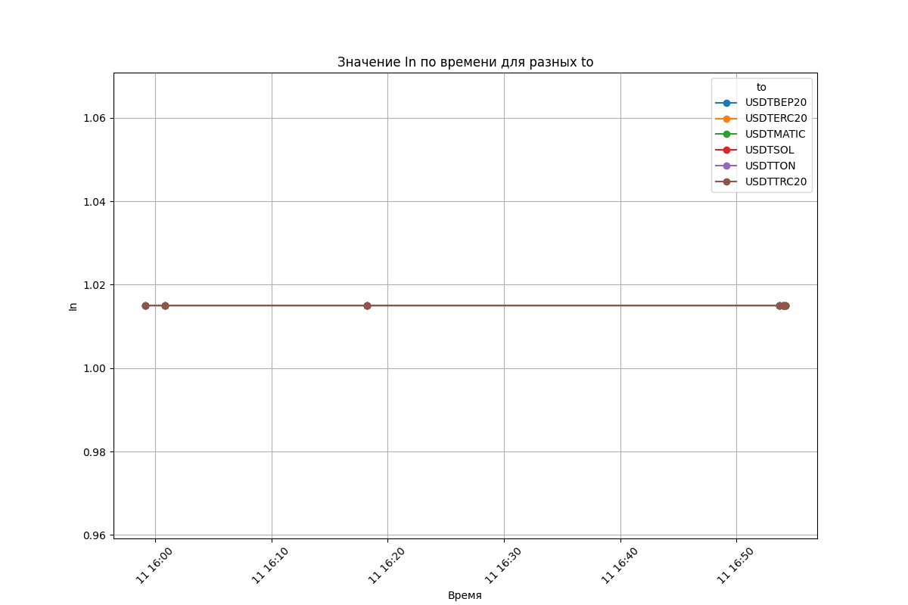
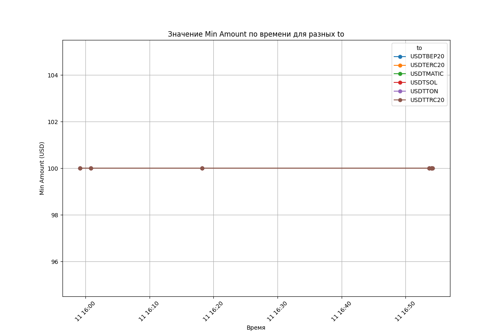

# Alltrust.me Exchange Rate Monitoring

## Описание проекта

Alltrust.me Exchange Rate Monitoring — это проект, созданный для мониторинга и визуализации данных об обменных курсах. Основная цель проекта — помочь пользователям найти подходящий момент для обмена валюты с USD на пары, начинающиеся с USDT, по выгодному курсу. Проект включает скрипты для автоматического сбора данных, их сохранения в формате CSV, а также для создания графиков, которые наглядно показывают изменения курсов с течением времени.

## Цель проекта

Цель проекта — предоставить удобный инструмент для мониторинга и визуализации обменных курсов, чтобы пользователи могли принимать обоснованные решения и обменивать валюту по наиболее выгодному курсу.

## Установка

Для работы проекта необходим Python 3.x и несколько библиотек. Следуйте инструкциям ниже для установки:

1. Клонируйте репозиторий на вашу локальную машину:

   ```bash
   git clone https://github.com/paantya/alltrust.me-exchange-rate-monitoring.git
   cd alltrust.me-exchange-rate-monitoring
   ```

2. Установите необходимые библиотеки:

   ```bash
   pip install -r requirements.txt
   ```

## Использование

### Шаг 1: Сбор данных

Скрипт `fetch_data.py` отвечает за загрузку данных с указанного URL, их парсинг и сохранение в CSV файл. Для запуска скрипта вручную выполните команду:

```bash
python scripts/fetch_data.py
```

Данные будут сохранены в файл `data/data_log.csv`.

### Автоматический запуск с помощью crontab

Если вы хотите автоматизировать процесс сбора данных, вы можете настроить `crontab` для запуска скрипта каждые 2 минуты:

1. Откройте crontab для редактирования:

   ```bash
   crontab -e
   ```

2. Добавьте следующую строку в файл crontab, чтобы скрипт запускался каждые 2 минуты:

   ```bash
   */2 * * * * /usr/bin/python3 /путь/к/вашему/репозиторию/alltrust.me-exchange-rate-monitoring/scripts/fetch_data.py
   ```

   Замените `/usr/bin/python3` на путь к вашему Python интерпретатору, если он отличается, и `/путь/к/вашему/репозиторию/` на путь к репозиторию на вашем компьютере.

3. Сохраните и закройте crontab. Скрипт будет автоматически запускаться каждые 2 минуты.

### Шаг 2: Визуализация данных

Скрипт `visualize_data.py` генерирует графики на основе собранных данных. Графики будут отображать различные параметры по времени и по валютным парам. Для запуска скрипта выполните команду:

```bash
python scripts/visualize_data.py
```

Графики будут сохранены в директорию `plots/` и также будут отображены на экране.

### Примеры графиков

Ниже приведены примеры сгенерированных графиков:

1. **Amount по времени для разных валютных пар:**

   

2. **In по времени для разных валютных пар:**

   

3. **Min Amount по времени для разных валютных пар:**

   

4. **Max Amount по времени для разных валютных пар:**

   

### Запуск в Docker контейнере через скрипт `run.sh`

Вместо ручного ввода команды для запуска Docker контейнера, вы можете использовать подготовленный скрипт `run.sh`, который автоматизирует этот процесс.

1. Убедитесь, что у вас установлен Docker.

2. Создайте файл `run.sh` в корневой директории проекта и добавьте в него следующий код:

   ```bash
   #!/bin/bash

   docker stop $(basename $(pwd))
   docker rm $(basename $(pwd))
   docker run --restart always -v $(pwd):$(pwd) --name $(basename $(pwd)) python:3.6-slim /bin/sh -c "/usr/local/bin/python -m pip install --upgrade pip; cd $(pwd); pip3 install -r ./requirements.txt; pip3 cache purge; python3 ./scripts/fetch_data.py 2> w.err"
   ```

3. Сделайте скрипт исполняемым:

   ```bash
   chmod +x run.sh
   ```

4. Запустите скрипт:

   ```bash
   ./run.sh
   ```

   Этот скрипт выполнит следующие действия:
   - Останавливает и удаляет предыдущий контейнер с тем же именем, если он существует.
   - Создает и запускает новый контейнер с автоперезапуском при сбоях (`--restart always`).
   - Монтирует текущую директорию (`$(pwd)`) в контейнер.
   - Обновляет pip, устанавливает все зависимости, указанные в `requirements.txt`, очищает кэш pip и запускает скрипт `fetch_data.py`.

### Автоматизация запуска через crontab

Если вы хотите автоматизировать запуск Docker контейнера с использованием `run.sh`, вы можете настроить `crontab` следующим образом:

1. Откройте crontab для редактирования:

   ```bash
   crontab -e
   ```

2. Добавьте следующую строку в файл crontab:

   ```bash
   */2 * * * * cd /путь/к/вашему/репозиторию/alltrust.me-exchange-rate-monitoring && ./run.sh
   ```

   Эта команда будет запускать скрипт `run.sh` каждые 2 минуты, автоматически управляя Docker контейнером.

### Лицензия

Этот проект распространяется под лицензией MIT. Подробнее см. файл [LICENSE](./LICENSE).

### Авторские права

Авторские права принадлежат Anton Patshin. Вы можете использовать этот проект в соответствии с условиями лицензии MIT.
лючает все необходимые инструкции для удобного и автоматизированного использования проекта с Docker и `crontab`.